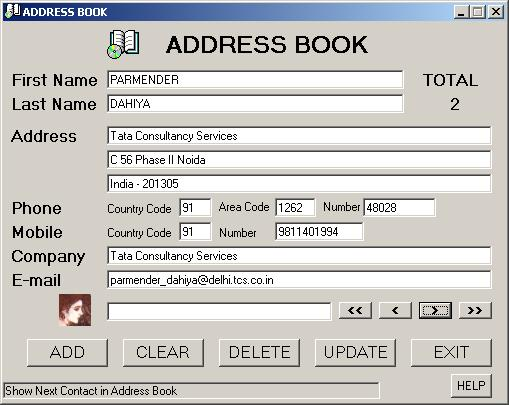

<div align="center">

## A          0        Cool Address Book


</div>

### Description

Want to work with MSACCESS database? This code is for you. You can perform add, update, delete and searching operations on database. Best part is the searching.UPDATED WITH FULL HTML HELP ON 9th Oct. 2002.How to write to registry is also explained with full error handling.Please vote for me....
 
### More Info
 


<span>             |<span>
---                |---
**Submitted On**   |2002-07-30 20:40:36
**By**             |[Parmender Dahiya](https://github.com/Planet-Source-Code/PSCIndex/blob/master/ByAuthor/parmender-dahiya.md)
**Level**          |Intermediate
**User Rating**    |4.6 (337 globes from 74 users)
**Compatibility**  |VB 6\.0
**Category**       |[Databases/ Data Access/ DAO/ ADO](https://github.com/Planet-Source-Code/PSCIndex/blob/master/ByCategory/databases-data-access-dao-ado__1-6.md)
**World**          |[Visual Basic](https://github.com/Planet-Source-Code/PSCIndex/blob/master/ByWorld/visual-basic.md)
**Archive File**   |[A\_\_\_\_\_\_\_\_\_1432171092002\.zip](https://github.com/Planet-Source-Code/parmender-dahiya-a-0-cool-address-book__1-37393/archive/master.zip)

### API Declarations

```
Declare Function RegSetValueEx Lib "advapi32.dll" Alias "RegSetValueExA" (ByVal hKey As Long, ByVal lpValueName As String, ByVal Reserved As Long, ByVal dwType As Long, ByVal lpData As String, ByVal cbData As Long) As Long
Declare Function RegOpenKeyEx Lib "advapi32.dll" Alias "RegOpenKeyExA" (ByVal hKey As Long, ByVal lpSubKey As String, ByVal ulOptions As Long, ByVal samDesired As Long, phkResult As Long) As Long
Declare Function RegCloseKey Lib "advapi32.dll" (ByVal hKey As Long) As Long
```


